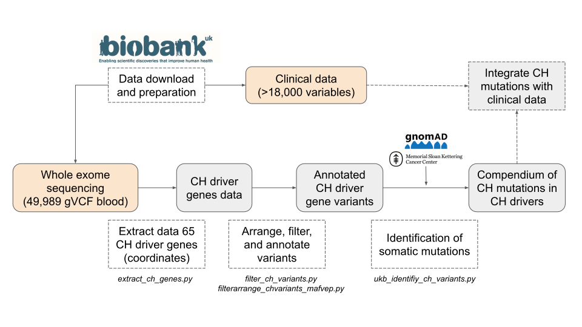

# Final Master's Project - Santiago Demajo Meseguer

This repository contains the code developed to process and analyze the data during this Final Master's Project (TFM):

- Title: **Identification and characterization of clonal hematopoiesis mutations in the general population from the UK Biobank**
- Program: **Máster Universitario de Bioinformática y Bioestadística, Universitat Oberta de Catalunya (UOC) and Universitat de Barcelona (UB)**: https://estudios.uoc.edu/es/masters-universitarios/bioinformatica-bioestadistica/presentacion
- Author: **Santiago Demajo Meseguer**
- Directed by: **Núria López-Bigas** and **Abel González-Pérez**
- Academic supervisor UOC: **Óscar Reina García**
- Study performed at the Barcelona Biomedical Genomics Lab (IRB Barcelona): https://bbglab.irbbarcelona.org/
- Date: February-June 2021

The following figure shows the workflow followed to analyse the data from the UK Biobank (https://www.ukbiobank.ac.uk/), which constitutes the core of this study. Dashed line boxes represent the different analysis steps and are shown together with the name of the corresponding Python scripts.

The main scripts used to process the data are in the ***python_scripts*** folder.

The other six folders contain Jupyter Notebooks used to analyse the data, as follows:

1. ***UKB_extractCHgenes_notebooks***: extraction of 65 CH driver gene variant data from UKB.
2. ***UKB_filterCHvariants_notebooks***: arranging, filtering, and annotation of variants from CH driver genes from UKB.
